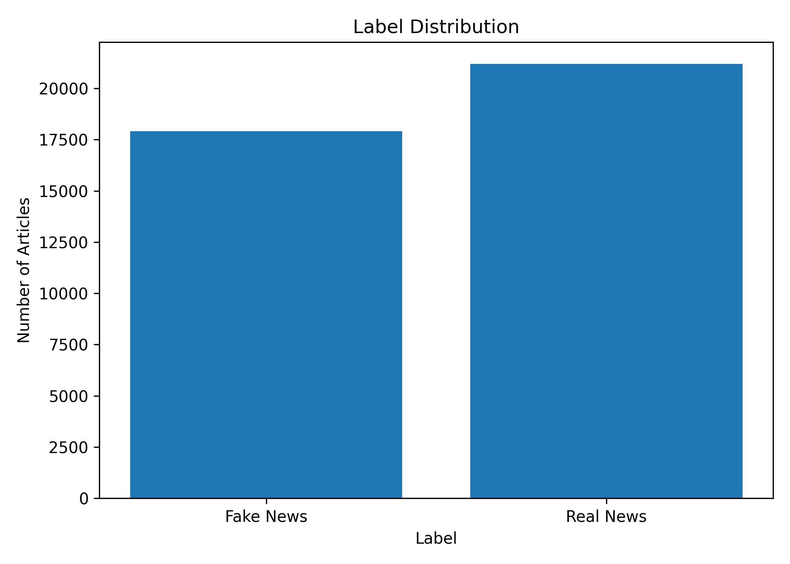
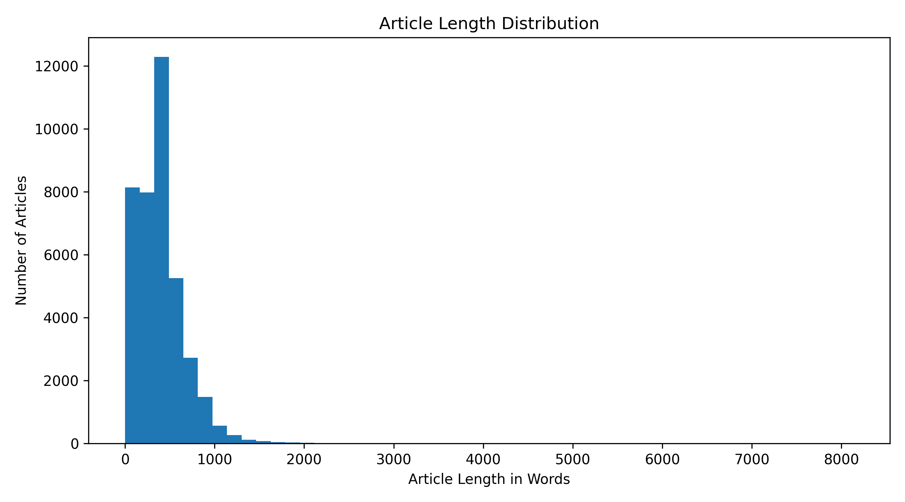
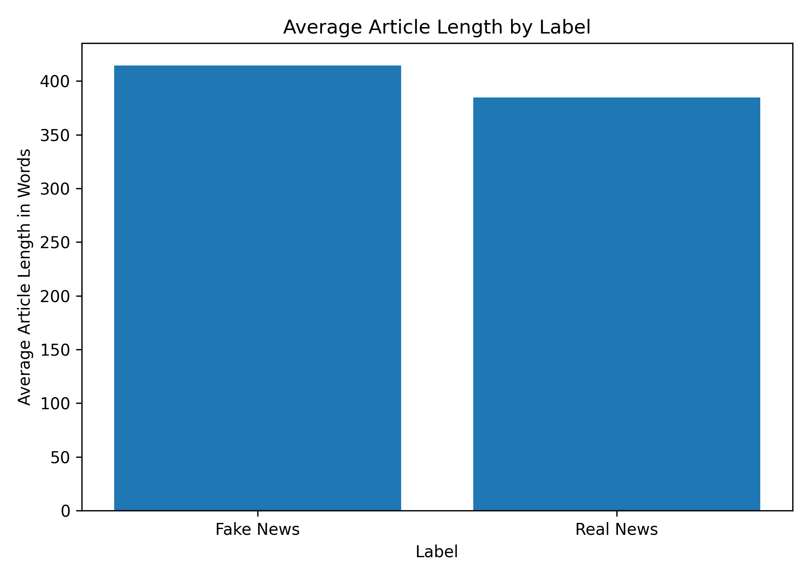
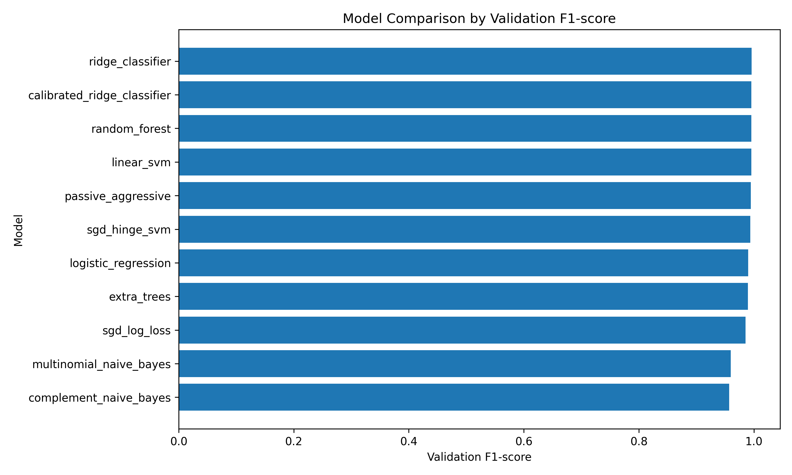
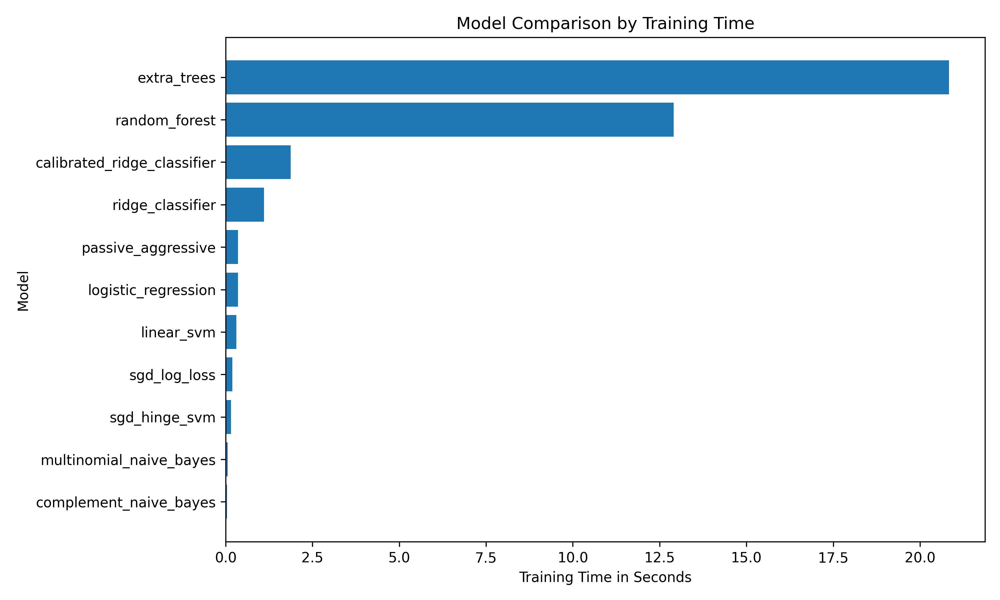
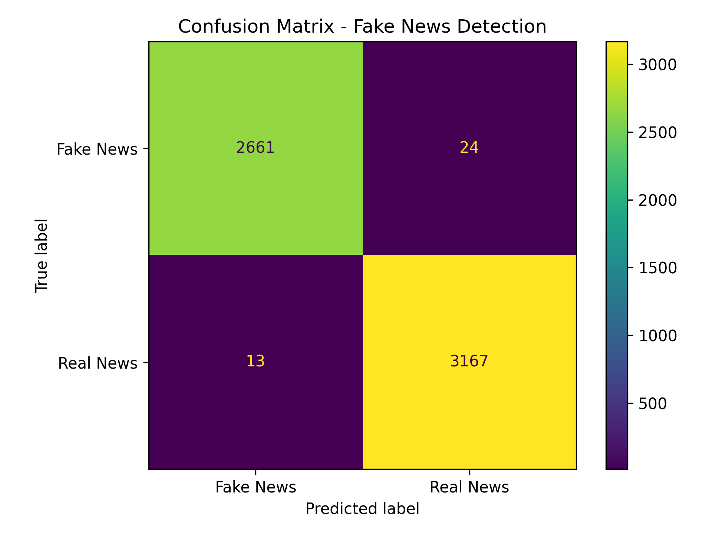
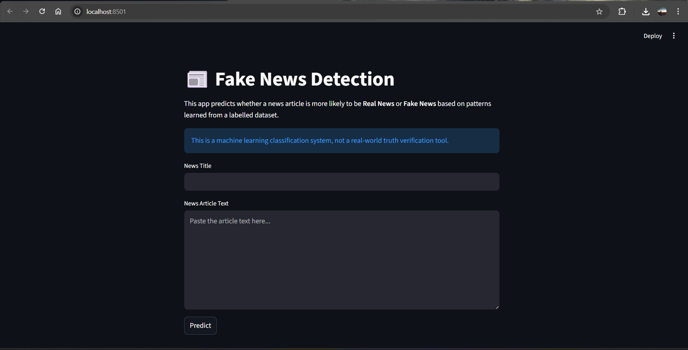
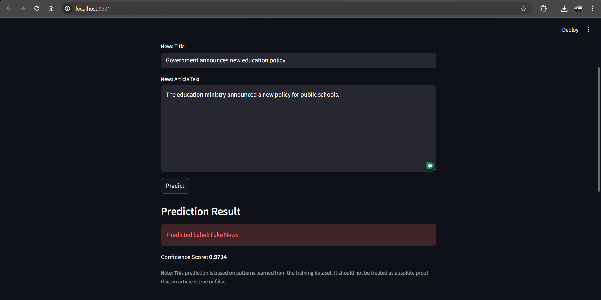

# Fake News Detection using NLP and Machine Learning

This project builds a machine learning system that classifies news articles as **Real News** or **Fake News** using Natural Language Processing (NLP). It compares multiple traditional machine learning models using TF-IDF features and selects the best-performing model based on validation F1-score.

The goal of this project is not to create a perfect truth verification system. Instead, it is a supervised NLP classification system trained on labelled fake/real news datasets. The model learns language patterns from the dataset and predicts whether a given article is more similar to real or fake news examples from the training data.

---

## Project Overview

Fake news detection is treated as a binary text classification problem.

Given a news title and article body, the model predicts one of two classes:

```text
0 = Fake News
1 = Real News
```

The project follows a complete machine learning workflow:

```text
Raw Dataset
↓
Data Cleaning
↓
Exploratory Data Analysis
↓
Text Preprocessing
↓
TF-IDF Feature Extraction
↓
Model Training
↓
Model Comparison
↓
Best Model Selection
↓
Final Evaluation
↓
Saved Model
↓
Prediction / Streamlit App
```

---

## Features

- Loads real and fake news datasets
- Combines news title and article body
- Handles missing values
- Removes duplicate articles
- Performs exploratory data analysis
- Cleans text for traditional ML models
- Converts text into TF-IDF features
- Trains multiple machine learning models
- Compares models using accuracy, precision, recall, F1-score, and training time
- Saves model comparison results as CSV and JSON
- Saves the best model and TF-IDF vectorizer
- Generates model comparison charts
- Generates a confusion matrix for the final model
- Supports command-line prediction
- Includes a Streamlit web app for interactive prediction

---

## Dataset

The first version of this project uses the **ISOT Fake News Dataset**.

The dataset usually contains two CSV files:

```text
True.csv
Fake.csv
```

Place both files inside:

```text
data/raw/
```

Expected folder structure:

```text
data/
└── raw/
    ├── True.csv
    └── Fake.csv
```

The raw dataset files are not included in this repository because they may be large. Download the dataset separately and place it in the required folder.

---

## Exploratory Data Analysis

Before training the models, basic exploratory data analysis was performed to understand the dataset structure, class balance, and article length patterns.

### Label Distribution



### Article Length Distribution



### Average Article Length by Label



---

## Project Structure

```text
fake-news-detection/
│
├── app/
│   └── streamlit_app.py
│
├── data/
│   ├── raw/
│   │   └── .gitkeep
│   └── processed/
│       └── .gitkeep
│
├── models/
│   └── .gitkeep
│
├── notebooks/
│
├── reports/
│   └── figures/
│       └── .gitkeep
│
├── src/
│   ├── __init__.py
│   ├── config.py
│   ├── data_loader.py
│   ├── eda.py
│   ├── evaluate.py
│   ├── predict.py
│   ├── preprocess_text.py
│   └── train_tfidf_models.py
│
├── .gitignore
├── main.py
├── README.md
└── requirements.txt
```

---

## Models Used

The project compares the following models:

| Model | Purpose |
|---|---|
| Multinomial Naive Bayes | Fast baseline model for text classification |
| Complement Naive Bayes | Naive Bayes variant useful for imbalanced text data |
| Logistic Regression | Strong and explainable linear baseline |
| Linear SVM | Strong classifier for sparse TF-IDF text features |
| Ridge Classifier | Fast and effective linear classifier |
| Calibrated Ridge Classifier | Ridge model with probability/confidence support |
| Passive Aggressive Classifier | Online learning model often used for text classification |
| SGD Classifier | Efficient linear classifier trained using stochastic gradient descent |
| Random Forest | Tree-based comparison model |
| Extra Trees | Ensemble tree-based comparison model |

The final model is selected mainly based on validation F1-score. If the calibrated Ridge Classifier performs very close to the best model, it may be selected because it supports probability-based confidence scores for the Streamlit app.

---

## Model Comparison Results

Several machine learning models were trained using the same TF-IDF vectorizer and the same train-validation-test split. The models were compared using validation accuracy, precision, recall, F1-score, training time, and probability-support availability.

| Rank | Model | Validation Accuracy | Validation Precision | Validation Recall | Validation F1-score | Training Time |
|---:|---|---:|---:|---:|---:|---:|
| 1 | Ridge Classifier | 0.9954 | 0.9940 | 0.9975 | 0.9958 | 1.22s |
| 2 | Random Forest | 0.9951 | 0.9944 | 0.9965 | 0.9954 | 13.65s |
| 3 | Linear SVM | 0.9951 | 0.9947 | 0.9962 | 0.9954 | 0.50s |
| 4 | Passive Aggressive | 0.9944 | 0.9937 | 0.9959 | 0.9948 | 1.01s |
| 5 | SGD Hinge SVM | 0.9934 | 0.9912 | 0.9965 | 0.9939 | 0.18s |
| 6 | Logistic Regression | 0.9891 | 0.9863 | 0.9937 | 0.9900 | 0.47s |
| 7 | Extra Trees | 0.9884 | 0.9832 | 0.9956 | 0.9894 | 23.36s |
| 8 | SGD Log Loss | 0.9841 | 0.9786 | 0.9925 | 0.9855 | 0.20s |
| 9 | Multinomial Naive Bayes | 0.9564 | 0.9644 | 0.9547 | 0.9595 | 0.03s |
| 10 | Complement Naive Bayes | 0.9538 | 0.9654 | 0.9487 | 0.9570 | 0.03s |

The best-performing non-calibrated model was **Ridge Classifier**. A calibrated Ridge Classifier was also added to support confidence scores in the Streamlit application.

---

## Final Test Result

| Model | Test Accuracy | Test Precision | Test Recall | Test F1-score |
|---|---:|---:|---:|---:|
| Selected Best Model | 0.9940 | 0.9925 | 0.9965 | 0.9945 |

The model performed strongly on the held-out test set. However, this result should be interpreted as dataset-based classification performance, not real-world truth verification.

---

## Result Visualizations

### Model F1-score Comparison



### Model Training Time Comparison



### Final Confusion Matrix



---

## Installation

### 1. Clone the Repository

```bash
git clone https://github.com/Dexter087/fake-news-detection.git
cd fake-news-detection
```

### 2. Create a Virtual Environment

Using conda:

```bash
conda create -n fakenews python=3.10 -y
conda activate fakenews
```

Or using normal Python venv:

```bash
python -m venv venv
venv\Scripts\activate
```

### 3. Install Requirements

```bash
pip install -r requirements.txt
```

---

## Requirements

The main libraries used are:

```text
pandas
numpy
scikit-learn
matplotlib
seaborn
joblib
streamlit
```

---

## Full Project Run Order

Run the project in this order:

```bash
python -m src.data_loader
python -m src.eda
python -m src.train_tfidf_models
python -m src.evaluate
streamlit run app/streamlit_app.py
```

For command-line prediction only:

```bash
python -m src.predict
```

---

## Step-by-Step Usage

### Step 1: Prepare the Dataset

This script loads `True.csv` and `Fake.csv`, assigns labels, combines title and text, removes missing rows, removes duplicate rows, and saves a cleaned dataset.

```bash
python -m src.data_loader
```

Generated file:

```text
data/processed/cleaned_news.csv
```

---

### Step 2: Run Exploratory Data Analysis

This script generates dataset summary outputs and EDA visualizations.

```bash
python -m src.eda
```

Generated files:

```text
reports/eda_summary.txt
reports/figures/label_distribution.png
reports/figures/article_length_distribution.png
reports/figures/average_article_length_by_label.png
```

---

### Step 3: Train and Compare Models

This script cleans the text, creates TF-IDF features, trains multiple machine learning models, compares their metrics, saves model comparison reports, creates charts, and saves the selected best model.

```bash
python -m src.train_tfidf_models
```

Generated files:

```text
models/best_model.joblib
models/tfidf_vectorizer.joblib
reports/model_comparison.csv
reports/model_comparison.json
reports/figures/model_f1_scores.png
reports/figures/model_training_times.png
```

---

### Step 4: Evaluate the Saved Model

This script evaluates the selected saved model on the final test set and generates a confusion matrix.

```bash
python -m src.evaluate
```

Generated files:

```text
reports/final_evaluation.json
reports/final_summary.txt
reports/figures/confusion_matrix.png
```

---

### Step 5: Predict from Command Line

This script allows the user to enter a news title and article text from the terminal.

```bash
python -m src.predict
```

Example:

```text
Enter news title: Government announces new education policy
Enter news article text: The education ministry announced a new policy for public schools.
```

Example output:

```text
Predicted Label: Real News
```

or

```text
Predicted Label: Fake News
```

---

## Streamlit Web App

The project includes a simple Streamlit interface where users can enter a news title and article text and receive a prediction.

To run the app:

```bash
streamlit run app/streamlit_app.py
```

The app displays:

- Predicted label: Real News or Fake News
- Confidence score, if the selected model supports probability prediction
- Disclaimer about model limitations

This app is intended for demonstration and educational purposes only.

---

## Data Preprocessing

The project performs the following preprocessing steps:

- Fills missing title or text values
- Combines title and article body into a single `combined_text` column
- Removes empty articles
- Removes duplicate articles
- Converts text to lowercase
- Removes URLs
- Removes email addresses
- Removes HTML tags
- Removes numbers
- Removes punctuation
- Removes extra spaces

The cleaned text is then converted into numerical features using TF-IDF.

---

## TF-IDF Settings

The project uses the following TF-IDF settings:

```python
TfidfVectorizer(
    max_features=50000,
    ngram_range=(1, 2),
    min_df=2,
    max_df=0.9,
    stop_words="english"
)
```

These settings allow the model to use both single words and two-word phrases while avoiding extremely rare or overly common terms.

---

## Evaluation Metrics

The models are evaluated using:

| Metric | Meaning |
|---|---|
| Accuracy | Overall percentage of correct predictions |
| Precision | How many predicted labels were actually correct |
| Recall | How many actual class examples were correctly detected |
| F1-score | Balance between precision and recall |
| Confusion Matrix | Shows correct and incorrect predictions for both classes |
| Classification Report | Gives precision, recall, and F1-score per class |

Accuracy alone is not enough because fake news detection has different types of mistakes. For example, marking a real article as fake and marking a fake article as real have different consequences.

---

## Why Multiple Models Were Trained

Different models learn patterns in different ways. Training multiple models helps compare algorithms under the same dataset, preprocessing, and TF-IDF feature extraction setup.

The comparison is useful because:

- Naive Bayes is very fast and useful as a baseline.
- Logistic Regression is strong and explainable.
- Linear SVM performs well on sparse high-dimensional text data.
- Ridge Classifier performs strongly with TF-IDF features.
- Calibrated Ridge Classifier supports confidence scores.
- Tree-based models provide additional comparison but may take longer.

This makes the project more reliable than training only one model.

---

## Files Not Included in the Repository

The following files are generated locally and are not included in the repository:

```text
data/raw/
data/processed/
models/
reports/*.json
reports/*.txt
```

The raw dataset should be downloaded separately and placed inside:

```text
data/raw/
```

Expected dataset files:

```text
True.csv
Fake.csv
```

The trained model files are generated by running:

```bash
python -m src.train_tfidf_models
```

---

## App Screenshots

### Streamlit Interface



### Prediction Example



---

## Limitations

This model should not be treated as a perfect fake news detector.

Important limitations:

- The model learns patterns from the training dataset.
- It may learn source-specific writing styles instead of true misinformation signals.
- It may learn topic patterns that are specific to the dataset.
- It cannot verify facts using live external sources.
- It does not check trusted evidence or citations.
- It may not generalize well to news from completely different sources.
- It may perform poorly on satire, opinion pieces, short statements, or newly emerging news.

The prediction should be understood as a dataset-based classification result, not as absolute truth verification.

---

## Future Improvements

Possible future improvements include:

- Add exploratory notebook version of the EDA
- Add word cloud and article length visualizations
- Add ROC-AUC evaluation
- Add hyperparameter tuning
- Add external validation using another dataset such as LIAR
- Add model explainability using feature importance or SHAP
- Add DistilBERT fine-tuning
- Deploy the Streamlit app online
- Add automated tests
- Add Docker support

---

## Disclaimer

This project is for educational and portfolio purposes. The model predicts based on patterns learned from labelled datasets and should not be used as the only source for judging whether a real-world news article is true or false.

---

## Dataset License and Usage

This project uses the ISOT Fake News Dataset for educational and research purposes. The dataset is not included in this repository.

Users should download the dataset from the official ISOT Research Lab source or another authorized dataset host and place the files inside `data/raw/`:

'''text'''
data/raw/True.csv
data/raw/Fake.csv

---

## Dataset Citation

If you use the ISOT Fake News Dataset, cite the original works recommended by the dataset authors:

Ahmed, H., Traore, I., & Saad, S. (2018). Detecting opinion spams and fake news using text classification. Journal of Security and Privacy, 1(1), Wiley.

Ahmed, H., Traore, I., & Saad, S. (2017). Detection of Online Fake News Using N-Gram Analysis and Machine Learning Techniques. In Intelligent, Secure, and Dependable Systems in Distributed and Cloud Environments, Lecture Notes in Computer Science, vol. 10618, Springer, Cham, pp. 127–138.

---

## Dataset License

The source code in this repository is released under the MIT License.

The dataset is not included in this repository and is subject to the terms of the original dataset provider. Users are responsible for downloading and using the dataset according to the provider's terms.

---
